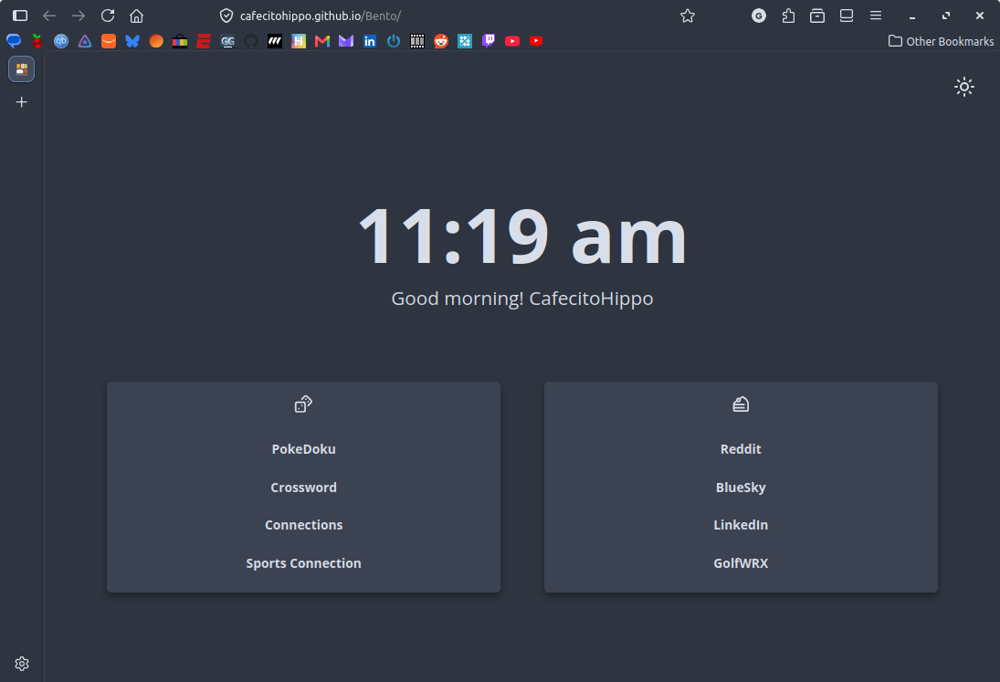

# dots-ish

## Dotfiles for my LMDE 7 Gigi - Nord Theme

### Screenshots

#### Desktop
GTK Theme - [Nordic](https://github.com/EliverLara/Nordic) by [EliverLara](https://github.com/EliverLara/) -- Dock made using [Plank-Reloaded](https://github.com/zquestz/plank-reloaded) with my [Material-Nord](plank/Material-Nord/dock.theme). Just put this in ~/.local/share/plank/themes/Material-Nord.

#### FastFetch
Installation: Save the config.jsonc and mamoswine.png to ~/.config/fastfetch. Prompt is [Tide](https://github.com/IlanCosman/tide) by [IlanCosman](https://github.com/IlanCosman)

#### Discord
Adjusted color theme of [Midnight - Nord Theme](https://raw.githubusercontent.com/refact0r/midnight-discord/refs/heads/master/themes/flavors/midnight-nord.theme.css) theme by [refact0r](https://github.com/refact0r). Installation: Install [Vencord](https://vencord.dev/) and paste link in Online Themes under Vencord Settings.

#### Spotify
Using the [Sleek theme](https://github.com/spicetify/spicetify-themes/tree/master/Sleek) from the Marketplace installed via [Spicetify](https://spicetify.app/).

#### Firefox
Firefox home screen using [Bento](https://github.com/migueravila/Bento) from [migueravila](https://github.com/migueravila/)

